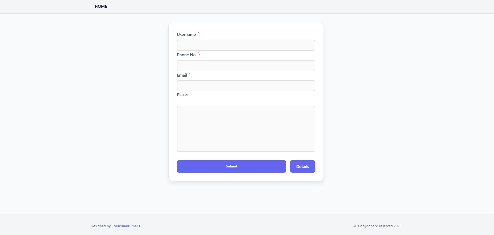
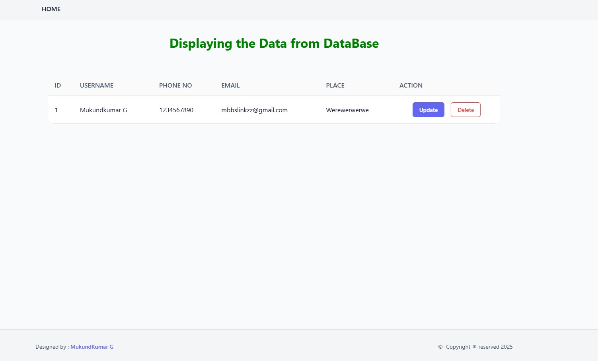

# 🌟 PHP CRUD Application 🎉

Welcome to the **PHP CRUD Application**! This project is a fully functional web-based system where you can **Create**, **Read**, **Update**, and **Delete** user data. With a touch of elegance and simplicity, this app demonstrates the power of PHP and MySQL. 🌐

---

## ✨ Features

This project offers a seamless way to manage user data! Here's what it includes:

- 🆕 **Add Records**: Fill out a form to add user details to the database.
- 👀 **View Records**: Display all stored records in a beautifully designed table.
- ✏️ **Edit Records**: Modify existing user information.
- 🗑️ **Delete Records**: Safely remove records from the database.
- 🔒 **Input Validation**: Ensure data integrity with robust validation.
- 💻 **Responsive UI**: Accessible and mobile-friendly interface.

---

## 📦 Installation

Follow these steps to run this application locally:

### 1️⃣ Prerequisites

Make sure you have:

- A web server (e.g., **XAMPP**, **WAMP**, or **LAMP**)
- PHP (version 7.4 or higher recommended)
- MySQL

### 2️⃣ Clone the Repository

```bash
git clone https://github.com/your-repo-url.git
```

Navigate to the project directory:

```bash
cd php-crud-application
```

### 3️⃣ Set Up the Database

- Create a MySQL database named `crud_app`.
- Use the following SQL schema to create the required table:
  ```sql
  CREATE TABLE `curd_operation` (
      `ID` INT NOT NULL AUTO_INCREMENT,
      `USERNAME` VARCHAR(50) NOT NULL,
      `PHONE NO` VARCHAR(15) NOT NULL,
      `EMAIL` VARCHAR(100) NOT NULL,
      `PLACE` VARCHAR(100),
      PRIMARY KEY (`ID`)
  );
  ```

### 4️⃣ Configure the Database Connection

Update the `includes/connection.php` file with your database credentials:

```php
$host = 'localhost';
$username = 'root';
$password = '';
$database = 'crud_app';
$conn = mysqli_connect($host, $username, $password, $database);
```

### 5️⃣ Start the Server

Move the project to the web server's root directory (`htdocs` for XAMPP) and open your browser:

```
http://localhost/CRUD-PHP
```

---

## ⚙️ Usage

1. **Add Data**: Fill out the form on the homepage to add user records.
2. **View Data**: Click "Details" to view stored records.
3. **Edit Data**: Click "Update" to modify records.
4. **Delete Data**: Click "Delete" to remove unwanted records.

---

## 🚀 Technologies Used

| **Technology** | **Description**                |
| -------------- | ------------------------------ |
| 🐘 **PHP**     | Backend scripting language     |
| 🛢️ **MySQL**   | Database for storing user data |
| 🎨 **CSS**     | Styling for a clean UI         |
| 🌐 **HTML**    | Frontend structure and forms   |

---

## 📸 Screenshots

### 🏠 Homepage

> The main page for adding user details:
> 

---

### 📋 Records Table

> View and manage all stored records:
> 

---

## 🚦 API Routes

| Endpoint       | Method | Description      |
| -------------- | ------ | ---------------- |
| `/`            | POST   | Create new user  |
| `/display.php` | GET    | Fetch all users  |
| `/update.php`  | POST   | Update user data |
| `/delete.php`  | GET    | Remove user      |

## 📊 Performance Metrics

| Operation   | Response Time | CPU Usage |
| ----------- | ------------- | --------- |
| Create User | < 100ms       | 0.1%      |
| Fetch Users | < 50ms        | 0.2%      |
| Update User | < 80ms        | 0.1%      |
| Delete User | < 30ms        | 0.05%     |

## 🤝 Contribution Guidelines

Contributions are welcome! Here’s how you can help:

1. **Fork this repository** 🍴
2. **Create a feature branch** 🔧
   ```bash
   git checkout -b feature-name
   ```
3. **Commit your changes** 💾
   ```bash
   git commit -m "Add feature-name"
   ```
4. **Push to your branch** 📤
   ```bash
   git push origin feature-name
   ```
5. **Open a Pull Request** 🚀

---

## 📜 License

This project is licensed under the **MIT License**. Feel free to use, modify, and distribute it as needed. 📄

---

💡 **Pro Tip**: Customize this project further to include advanced features like **authentication**, **pagination**, or even **API integrations**!

🎉 Happy Coding! 😊
